<div align="center">

# 🔮 PinData

[](README.md) | [](README_CN.md)

*Enterprise Data Management Platform for the AI Era*


[🚀 Quick Start](#-quick-start) •
[📖 Documentation](#-documentation) •
[🎯 Use Cases](#-use-cases) •
[🏗️ Architecture](#️-architecture) •
[🤝 Contributing](#-contributing)

</div>

---

## ✨ What is PinData?


PinData is a **modern enterprise data management platform** for the AI era. It combines data engineering and dataset management capabilities to unify processing and analysis of both structured and unstructured enterprise data, transforming raw data into structured knowledge assets and high-quality training datasets that provide a solid data foundation for enterprise AI applications.

### 🎯 Why PinData?

- **🔧 Data Engineering Capabilities**: Unified processing of structured and unstructured data with complete data pipelines
- **🧠 Knowledge Asset Creation**: Transform enterprise raw data into structured knowledge repositories, enhancing data value
- **📚 Multi-Format Compatibility**: Intelligent processing of DOCX, PPTX, PDF and various enterprise document formats
- **🤖 AI-Driven Analysis**: Integrated large language models for intelligent data extraction and structured transformation
- **📊 Versioned Management**: Git-style data lineage tracking ensuring data governance and compliance
- **🔗 Ecosystem Integration**: Seamless integration with mainstream data platforms and AI training frameworks
- **🚀 Enterprise Architecture**: Built on modern technology stack supporting large-scale deployment and scaling

---

## 🎯 Use Cases

### 🏢 Large Enterprise Data Management
- **Knowledge Asset Inventory**: Unify and structure scattered enterprise documents, reports, and manuals
- **Data Governance & Compliance**: Establish complete data lineage tracking to meet regulatory and audit requirements
- **Cross-Department Collaboration**: Unified data management platform breaking down data silos and promoting knowledge sharing

### 🤖 Enterprise AI Transformation
- **Intelligent Knowledge Base**: Transform enterprise knowledge into structured data suitable for AI model learning
- **Business Data Mining**: Extract key information and insights from unstructured business documents
- **Customized AI Training**: Build high-quality training datasets for enterprise-specific scenarios

### 🎓 Academic & Research Institutions
- **Literature Management**: Large-scale processing and analysis of academic literature, building research databases
- **Interdisciplinary Research**: Unified management of multi-domain, multi-format research materials
- **Knowledge Graph Construction**: Transform research outcomes into structured knowledge networks (planned)

### 🏥 Professional Service Organizations
- **Case Library Management**: Transform historical cases and reports into analyzable structured data
- **Professional Knowledge Transfer**: Systematically store and transfer expert experience and knowledge
- **Business Intelligence Analysis**: Extract trends and patterns from business documents to support decision-making

---

## 🏗️ Architecture

```mermaid
graph TD
    A[📄 Unstructured Data] --> B[🔧 Data Engineering Layer]
    A1[📊 Structured Data] --> B
    B --> C[📝 Unified Parser]
    C --> D[🧹 Data Cleaner]
    D --> E[🔍 Smart Extractor]
    E --> F[🧠 Knowledge Structuring]
    F --> G[📊 Dataset Generation]
    F --> H[💾 Knowledge Base]
    
    I[🎛️ Enterprise Interface] --> J[🚀 API Gateway]
    J --> K[🗄️ Metadata DB]
    J --> L[📦 Object Storage]
    J --> M[⏰ Task Scheduler]
    J --> N[🤖 AI Service Layer]
    
    style A fill:#e1f5fe
    style A1 fill:#e1f5fe
    style G fill:#e8f5e8
    style H fill:#f3e5f5
    style I fill:#fff3e0
```



### Core Components

| Component | Technology | Purpose |
|-----------|------------|---------|
| **Data Engineering Layer** | Plugin-based processor architecture | Unified processing of structured and unstructured data |
| **Intelligent Parsing Engine** | MarkItDown + Custom parsers | Multi-format document parsing and content extraction |
| **Knowledge Structuring Service** | LangChain + Multi-LLM support | AI-driven content analysis and knowledge extraction |
| **Enterprise Interface** | React 18 + TypeScript | Management console for enterprise users |
| **Task Scheduling Engine** | Celery + Redis | Scheduling and management of data processing tasks |
| **Hybrid Storage System** | MinIO + PostgreSQL | File object storage + relational metadata management |

---

## 🚀 Quick Start

### Prerequisites
- 🐳 Docker Engine 20.10+ (The `docker compose` command is included automatically)
- 💾 4GB+ available RAM
- 📁 2GB+ available disk space

### One-Command Setup

```bash
# Clone the repository
git clone https://github.com/zutoData/pindata.git
cd pindata

# Start all services
docker compose up -d

# Access the application
open http://localhost:3000
```

### Build Your Enterprise Knowledge Assets in 3 Steps

1. **📁 Import Data**: Upload various enterprise documents and data files with unified management for multiple formats
2. **🔧 Intelligent Processing**: Automatically parse, clean, and structure your data through data engineering pipelines
3. **🧠 Knowledge Transformation**: Use AI technology to transform data into structured knowledge bases and usable datasets

---

## 💡 Key Features

### 🔧 Unified Data Engineering Pipeline
- **Multi-Source Data Integration**: Unified processing of structured and unstructured data
- **Intelligent Data Cleaning**: Automatically identify and handle data quality issues
- **Flexible Data Transformation**: Configurable data processing and transformation rules
- **Batch Parallel Processing**: Efficiently process large-scale datasets

### 🧠 AI-Driven Knowledge Extraction
- **Intelligent Content Analysis**: Use large language models for deep understanding and analysis of data content
- **Automatic Knowledge Extraction**: Automatically extract structured knowledge from unstructured data
- **Multi-LLM Support**: Support for OpenAI, Google Gemini, Anthropic Claude and other mainstream models
- **Customizable Extraction Rules**: Customize knowledge extraction strategies according to business needs

### 📊 Enterprise-Grade Data Management
- **Versioned Management**: Git-style data lineage tracking and version control
- **Permissions & Security**: Fine-grained data access control and security management
- **Data Governance**: Complete data lifecycle management and compliance support
- **Multi-Platform Integration**: Seamless integration with mainstream data platforms and AI training frameworks

### 🔌 Extensible Plugin Architecture (Planned)
```python
# Create custom data processors
class CustomDataProcessor(BaseProcessor):
    def process(self, data, config):
        # Your custom data processing logic
        return processed_data
        
# Create custom knowledge extractors  
class CustomKnowledgeExtractor(BaseExtractor):
    def extract(self, content, schema):
        # Your custom knowledge extraction logic
        return extracted_knowledge
```

---

## 🛠️ Development

### Local Development Setup

```bash
# Backend development
cd backend
python -m venv venv
source venv/bin/activate  # Windows: venv\Scripts\activate
pip install -r requirements.txt
cp config.example.env .env
python run.py

# Frontend development (new terminal)
cd frontend
npm install
npm run dev

# Celery worker (new terminal)
cd backend
./start_celery.sh
```

### Current Development Focus

The project is actively developing core features:
- Unified data engineering pipeline and multi-source data integration
- AI-driven intelligent data analysis and knowledge extraction
- Enterprise-grade data governance and permission management
- Extensible plugin system and custom processors
- Multi-platform data source integration and API interfaces

---

## 📊 Roadmap

### 🎯 Current Version (0.0.4) - Basic Data Engineering Platform
- ✅ Multi-format unified data integration and parsing
- ✅ AI-driven intelligent data analysis and knowledge extraction
- ✅ Data versioning and lineage tracking
- ✅ Enterprise-grade management interface
- ✅ Plugin-based data processing architecture

### 🚧 Next Release (1.0) - Enterprise Enhancement
- 🔄 Advanced data governance and compliance management
- 📊 Enterprise data asset inventory and analytics dashboard
- 👥 Multi-user collaboration and permission management system
- 🔌 Rich data source connectors (databases, APIs, file systems)
- 📈 Data quality monitoring and anomaly detection

### 🏢 Enterprise Version (2.0) - Comprehensive Data Management
- 🗃️ Enterprise-grade data warehouse integration
- 🤖 Automated data pipelines and workflows
- 📋 Data catalog and metadata management
- 🔍 Intelligent data discovery and recommendations
- 📊 Advanced business intelligence and reporting features

### 🌟 Future Vision - AI-Native Data Platform
- 🖼️ Multi-modal data processing (images, audio, video)
- 🧠 Self-learning data processing and optimization
- ☁️ Hybrid cloud and multi-cloud deployment support
- 🌐 Real-time data streaming and analysis
- 🤖 AI Agent-driven automated data management

---

## 🤝 Contributing

We welcome contributions from the community! Whether you're fixing bugs, adding features, or improving documentation, your help makes PinData better for everyone.

### Ways to Contribute
- 🐛 **Bug Reports**: Found an issue? Let us know!
- ✨ **Feature Requests**: Have an idea? We'd love to hear it!
- 💻 **Code Contributions**: Submit pull requests for fixes and features
- 📚 **Documentation**: Help improve our docs and examples
- 🧪 **Testing**: Help test new features and integrations

### Getting Started
1. Fork the repository
2. Create a feature branch (`git checkout -b feature/amazing-feature`)
3. Commit your changes (`git commit -m 'Add amazing feature'`)
4. Push to the branch (`git push origin feature/amazing-feature`)
5. Open a Pull Request

---

## 📄 License

PinData is open source software licensed under the [Apache License 2.0](LICENSE).

---

## 🌟 Star History

[](https://star-history.com/#zutoData/pindata&Date)

---


<div align="center">

**Made with ❤️ by the PinData Team**

[⭐ Star us on GitHub](https://github.com/zutoData/pindata)

</div>
