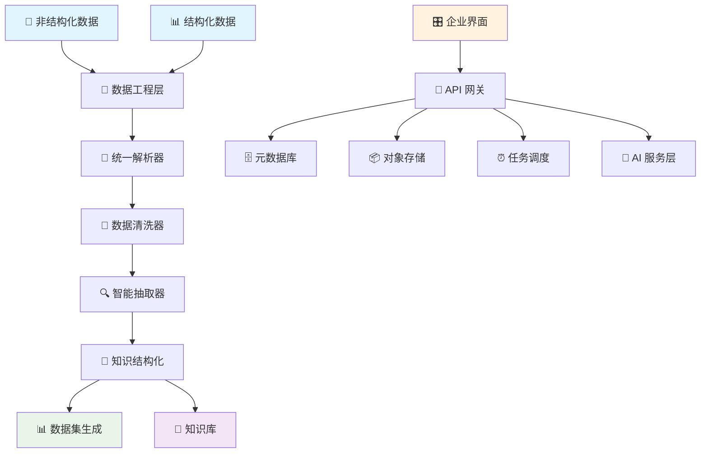

<div align="center">

# 🔮 PinData

[](README.md) | [](README_CN.md)

*AI时代的企业数据管理平台*


[🚀 快速开始](#-快速开始) •
[📖 文档说明](#-文档说明) •
[🎯 使用场景](#-使用场景) •
[🏗️ 系统架构](#️-系统架构) •
[🤝 参与贡献](#-参与贡献)

</div>

---

## ✨ 什么是 PinData？


PinData 是一个面向 AI 时代的**现代化企业数据管理平台**。它结合了数据工程和数据集管理的双重能力，能够统一处理和分析企业内部的非结构化与结构化数据，将原始数据转化为可结构化的知识资产和高质量训练数据集，为企业AI应用提供坚实的数据基础。

### 🎯 为什么选择 PinData？

- **🔧 数据工程能力**：统一处理非结构化和结构化数据，提供完整的数据处理管道
- **🧠 知识资产化**：将企业原始数据转化为结构化知识库，提升数据价值
- **📚 多格式兼容**：智能处理 DOCX、PPTX、PDF 等多种企业文档格式
- **🤖 AI 驱动分析**：集成大语言模型进行智能数据抽取和结构化转换
- **📊 版本化管理**：Git 风格的数据血缘追踪，确保数据治理和合规性
- **🔗 生态集成**：支持主流数据平台和AI训练框架的无缝对接
- **🚀 企业级架构**：基于现代技术栈构建，支持大规模部署和扩展

---

## 🎯 使用场景

### 🏢 大型企业数据管理
- **知识资产盘点**：将分散的企业文档、报告、手册统一管理和结构化
- **数据治理合规**：建立完整的数据血缘追踪，满足监管和审计要求
- **跨部门协作**：统一的数据管理平台，打破数据孤岛，促进知识共享

### 🤖 企业 AI 转型
- **智能知识库**：将企业知识转化为可供AI模型学习的结构化数据
- **业务数据挖掘**：从非结构化业务文档中提取关键信息和洞察
- **定制化AI训练**：为企业专属场景构建高质量训练数据集

### 🎓 学术与研究机构
- **文献管理**：大规模处理和分析学术文献，构建研究数据库
- **跨学科研究**：统一管理多领域、多格式的研究资料
- **知识图谱构建**：将研究成果转化为结构化知识网络（规划中）

### 🏥 专业服务机构
- **案例库管理**：将历史案例、报告转化为可分析的结构化数据
- **专业知识传承**：将专家经验和知识系统化存储和传递
- **业务智能分析**：从业务文档中提取趋势和模式，支持决策制定

---

## 🏗️ 系统架构



### 核心组件

| 组件 | 技术栈 | 功能 |
|------|--------|------|
| **数据工程层** | 插件化处理器架构 | 统一处理结构化和非结构化数据 |
| **智能解析引擎** | MarkItDown + 自定义解析器 | 多格式文档智能解析和内容提取 |
| **知识结构化服务** | LangChain + 多LLM支持 | AI驱动的内容分析和知识抽取 |
| **企业级界面** | React 18 + TypeScript | 面向企业用户的管理控制台 |
| **任务调度引擎** | Celery + Redis | 数据处理任务的调度管理 |
| **混合存储系统** | MinIO + PostgreSQL | 文件对象存储 + 关系型元数据管理 |

---

## 🚀 快速开始

### 前置条件
- 🐳 Docker 20.10+ 和 Docker Compose 1.29+
- 💾 4GB+ 可用内存
- 📁 2GB+ 可用磁盘空间

### 一键启动

```bash
# 克隆仓库
git clone https://github.com/zutoData/pindata.git
cd pindata

# 启动所有服务
cd docker
docker compose up -d

# 访问应用
open http://localhost:3000
```

### 3 步构建您的企业知识资产

1. **📁 导入数据**：上传各类企业文档、数据文件，支持多种格式的统一管理
2. **🔧 智能处理**：通过数据工程管道自动解析、清洗和结构化您的数据
3. **🧠 知识转化**：利用AI技术将数据转化为结构化知识库和可用数据集

---

## 💡 核心功能

### 🔧 统一数据工程管道
- **多源数据接入**：支持结构化和非结构化数据的统一处理
- **智能数据清洗**：自动识别和处理数据质量问题
- **灵活数据转换**：可配置的数据处理和转换规则
- **批量并行处理**：高效处理大规模数据集

### 🧠 AI 驱动的知识抽取
- **智能内容分析**：使用大语言模型深度理解和分析数据内容
- **自动知识提取**：从非结构化数据中自动提取结构化知识
- **多LLM支持**：支持 OpenAI、Google Gemini、Anthropic Claude 等主流模型
- **可定制提取规则**：根据业务需求定制知识抽取策略

### 📊 企业级数据管理
- **版本化管理**：Git 风格的数据血缘追踪和版本控制
- **权限与安全**：细粒度的数据访问控制和安全管理
- **数据治理**：完整的数据生命周期管理和合规性支持
- **多平台集成**：与主流数据平台和AI训练框架无缝对接

### 🔌 可扩展插件架构（规划中）
```python
# 创建自定义数据处理器
class CustomDataProcessor(BaseProcessor):
    def process(self, data, config):
        # 您的自定义数据处理逻辑
        return processed_data
        
# 创建自定义知识抽取器  
class CustomKnowledgeExtractor(BaseExtractor):
    def extract(self, content, schema):
        # 您的自定义知识抽取逻辑
        return extracted_knowledge
```

---

## 🛠️ 开发指南

### 本地开发环境搭建

```bash
# 后端开发
cd backend
python -m venv venv
source venv/bin/activate  # Windows: venv\Scripts\activate
pip install -r requirements.txt
cp config.example.env .env
python run.py

# 前端开发（新终端）
cd frontend
npm install
npm run dev

# Celery 工作进程（新终端）
cd backend
./start_celery.sh
```

### 当前开发重点

项目正在积极开发核心功能：
- 统一数据工程管道和多源数据接入
- AI 驱动的智能数据分析和知识抽取
- 企业级数据治理和权限管理
- 可扩展的插件系统和自定义处理器
- 多平台数据源集成和API接口

---

## 📊 发展路线图

### 🎯 当前版本 (0.0.4) - 基础数据工程平台
- ✅ 多格式数据统一接入和解析
- ✅ AI 驱动的智能数据分析和知识抽取
- ✅ 数据版本管理和血缘追踪
- ✅ 企业级管理界面
- ✅ 插件化数据处理架构

### 🚧 下一版本 (1.0) - 企业级增强
- 🔄 高级数据治理和合规性管理
- 📊 企业数据资产盘点和分析仪表板
- 👥 多用户协作和权限管理系统
- 🔌 丰富的数据源连接器（数据库、API、文件系统）
- 📈 数据质量监控和异常检测

### 🏢 企业版本 (2.0) - 全面数据管理
- 🗃️ 企业级数据仓库集成
- 🤖 自动化数据管道和工作流
- 📋 数据目录和元数据管理
- 🔍 智能数据发现和推荐
- 📊 高级业务智能和报表功能

### 🌟 未来愿景 - AI 原生数据平台
- 🖼️ 多模态数据处理（图像、音频、视频）
- 🧠 自学习的数据处理和优化
- ☁️ 混合云和多云部署支持
- 🌐 实时数据流处理和分析
- 🤖 AI Agent 驱动的自动化数据管理

---

## 🤝 参与贡献

我们欢迎社区贡献！无论您是修复错误、添加功能还是改进文档，您的帮助都让 PinData 变得更好。

### 贡献方式
- 🐛 **错误报告**：发现问题？请告诉我们！
- ✨ **功能请求**：有好想法？我们很乐意听到！
- 💻 **代码贡献**：为修复和功能提交拉取请求
- 📚 **文档完善**：帮助改进我们的文档和示例
- 🧪 **测试**：帮助测试新功能和集成

### 开始贡献
1. Fork 仓库
2. 创建功能分支（`git checkout -b feature/amazing-feature`）
3. 提交您的更改（`git commit -m 'Add amazing feature'`）
4. 推送到分支（`git push origin feature/amazing-feature`）
5. 开启 Pull Request

---

## 📄 许可证

PinData 是在 [Apache License 2.0](LICENSE) 下发布的开源软件。


---

## 🌟 Star 历史

[](https://star-history.com/#yourusername/pindata&Date)

---

<div align="center">

**由 PinData 团队用 ❤️ 制作**

[⭐ 在 GitHub 上给我们 Star](https://github.com/yourusername/pindata)

</div>
